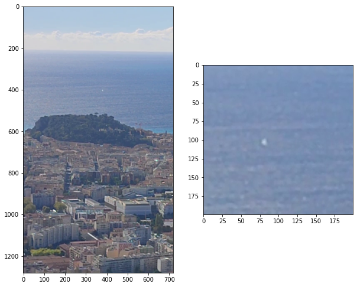

# Nice Cannon

## Overview
The Nice Midday Cannon, known locally as "le canon de midi," is a beloved tradition in Nice, France, where a loud boom is heard precisely at noon every day. This custom dates back to 1863, initiated by Thomas Coventry, a wealthy Englishman who wintered in Nice with his wife. The story goes that Coventry, frustrated by his wife's tardiness in returning home for lunch due to her socializing, arranged for a cannon to be fired to remind her of the time.

Originally, an actual cannon was used, positioned on the Castle Hill (Colline du Château). At 11:55 AM, Coventry would raise a time ball to signal the cannon's firing at noon. This practice became so popular that after a brief hiatus following Coventry's death, the city of Nice reinstated it in 1875 due to public demand. Today, the tradition continues with a firework known as an aerial maroon, which creates a loud but harmless explosion at noon every day. This event is managed by Philippe Arnello, who ensures the tradition remains a quirky yet integral part of Nice's daily life.



The code present in the Python notebook file analyzes the video and audio of the striking cannon to compute the distance between the observer and the cannon. The process involves the following steps:

1. **Video Processing**:
   - The video footage is analyzed to detect the visual moment when the cannon fires. This involves frame-by-frame analysis to identify the exact frame where the flash or smoke of the cannon appears.

2. **Audio Processing**:
   - The corresponding audio track is analyzed to detect the sound of the cannon firing. This involves extracting the audio signal and identifying the spike in sound level that corresponds to the cannon's boom.

3. **Synchronization**:
   - The time difference between the visual cue (flash/smoke) and the auditory cue (boom) is calculated. This time difference is crucial for computing the distance.

4. **Distance Calculation**:
   - Using the speed of sound (approximately 343 meters per second at sea level and at room temperature), the distance is calculated based on the time delay between seeing the cannon fire and hearing the sound. The formula used is:
     
     $\text{Distance} = \text{Time delay} \times \text{Speed of sound}$
   

The notebook likely includes the necessary Python libraries for video and audio processing, as well as functions for frame extraction, audio signal analysis, and distance computation. The results are typically displayed in a clear and concise manner, often with visualizations to aid in understanding the process and outcomes.

## Features
- Simulates cannonball trajectories
- Uses physics-based calculations
- Visualizes results with plots

## Repository Structure
- `data/`: Contains data files used in the simulations.
- `cannon.ipynb`: Jupyter Notebook with the simulation code and explanations.

## Requirements
- Python 3.x
- Jupyter Notebook
- Required libraries (listed in `requirements.txt`)

## Installation
Clone the repository:
```sh
git clone https://github.com/AlexeySergeyev/nice-cannon.git
cd nice-cannon
```
## Usage
Open `cannon.ipynb` with Jupyter Notebook:
```sh
jupyter notebook cannon.ipynb
```
Follow the instructions in the notebook to run the simulations.

## Contributing
Feel free to submit issues or pull requests. Contributions are welcome!

## License
This project is licensed under the MIT License.

## Contact
For any inquiries, please contact Alexey Sergeyev.
